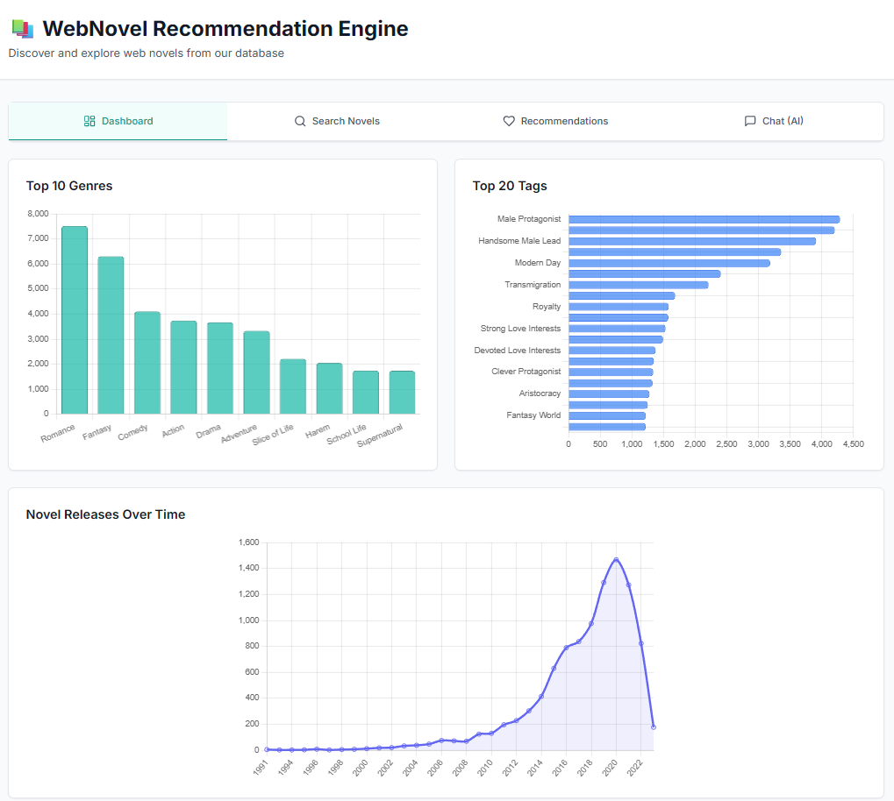
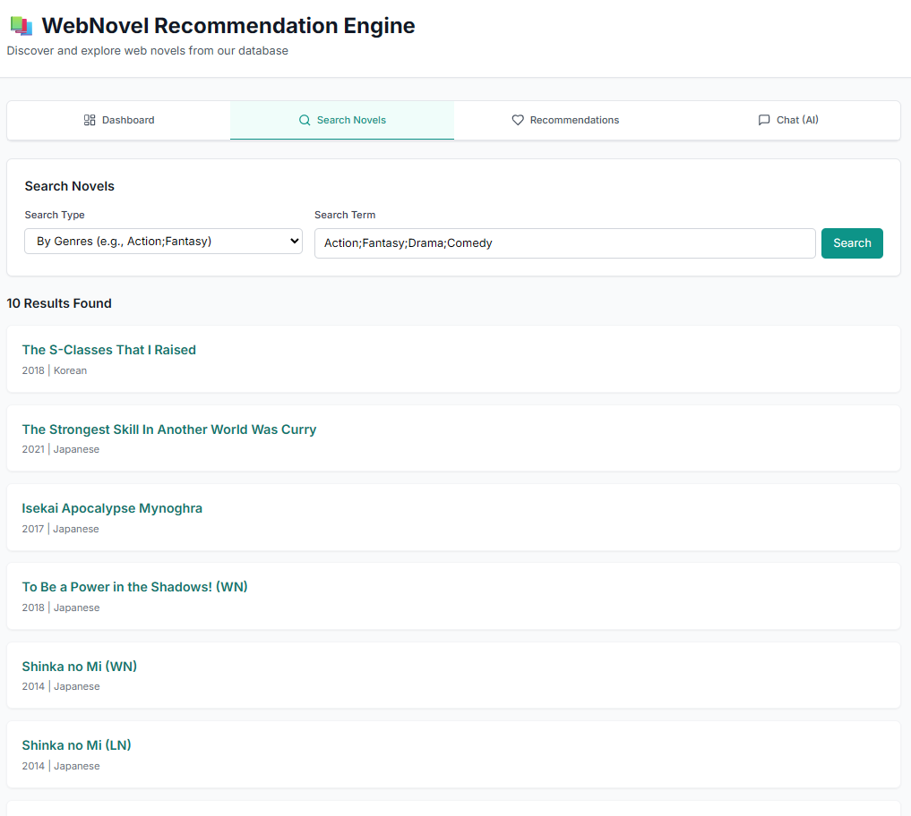
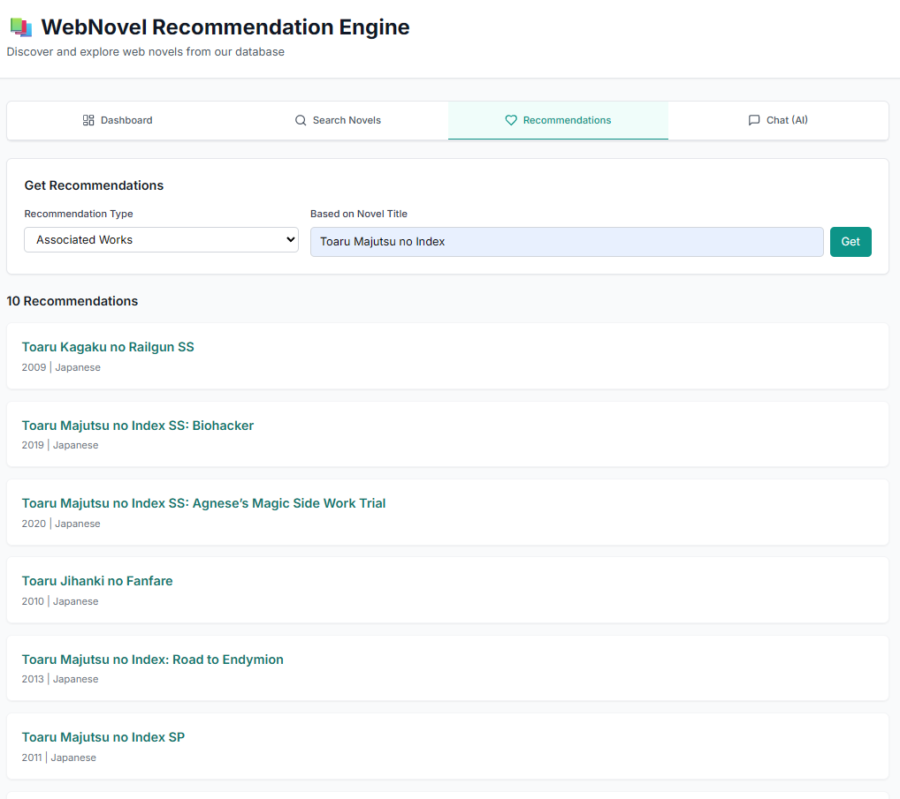
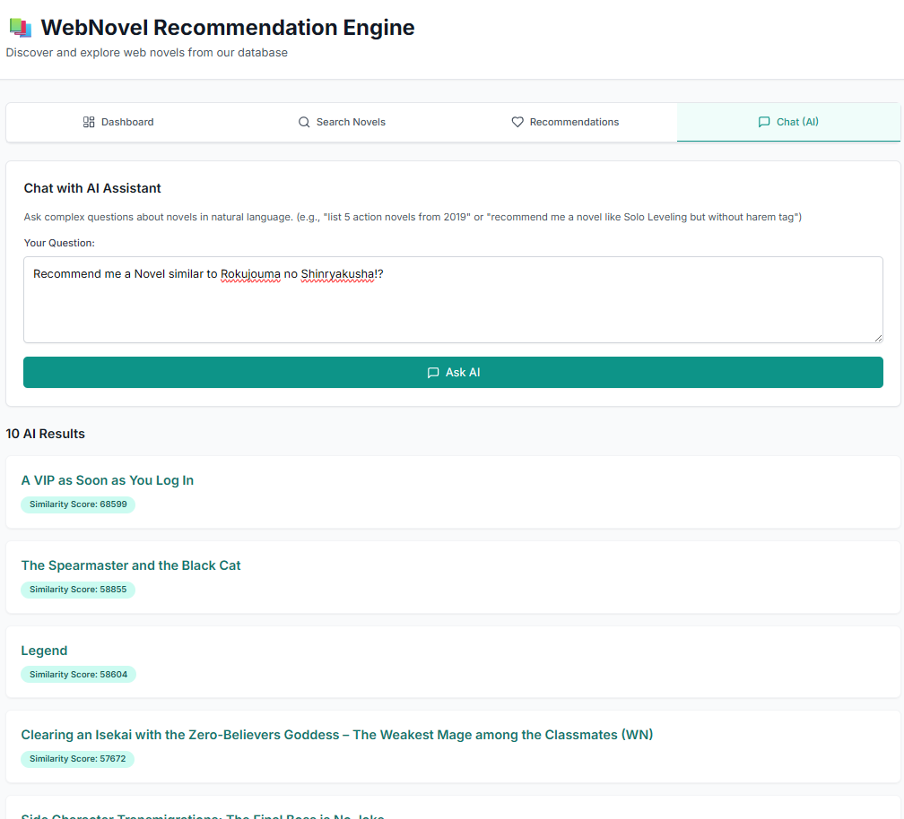

<!-- HEADER STYLE: CLASSIC -->

# Web Novel Recommendation System using Neo4j Graph Database

<em>Final Project for EF234505 - Knowledge Based Systems Engineering (I)</em>

<em>Built with the tools and technologies:</em>
<!-- BADGES -->

|    NRP     |      Name      |
| :--------: | :------------: |
| 5025231085 | Muhammad Rafly Abdillah |
| 5025231069 | R. Rafif Aqil Aabid Hermawan |
| 5025231075 | Reino Yuris Kusumanegara |
| 5025231161 | Muhammad Rizqy Hidayat |
| 5025231011 | Fazle Robby Pratama |

## Instruction
Requirements:
- Neo4j
- Neo4j APOC Plugin
- Python
- Neo4j Python Package (use `pip install neo4j`)
- LangChain Python Package (use `pip install langchain`)
- LangChain-Neo4j Package (use `pip install langchain_neo4j`)
- LangChain-GoogleGenAI Package (use `pip install langchain_google_genai`)

Constructor Steps:
- Create a Neo4j database within your local instance
- Run the instance
- Edit `globalVars.py` with the corresponding information:
  - URI can be found in local instances tab, is usually `URI = "neo4j://127.0.0.1:7687"`
  - AUTH is the credentials that you use when you create the instance, example: `AUTH = ("neo4j", "password")`
  - DBNAME is the database name that you want to use within the local instance, example: `DBNAME = "FINAL PROJECT"`
  - DATASET is the dataset used, we use `DATASET = "wn.csv"`
- Run `constructor.py` to initialize the database. It will take a while as there is ~11k rows of Novel information
- After finishing, you can see your instance for the result
- Use `CLI.py` for playground

Running the Web Application:
- Add gemini API key inside a `.env`
- Run the Neo4j instance
- On root folder, run `python -m backend.api`
- Serve `index.html` 
- Application is now ready to use in `localhost:5500`

## Samples

